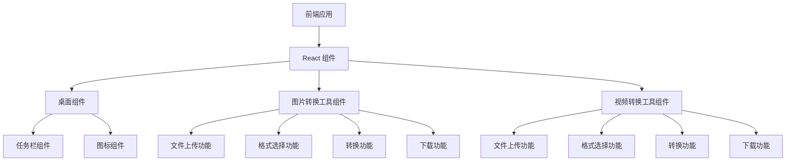

## 1. Architecture Design

## 2. Technology Description
- 前端：React@18 + tailwindcss@3 + vite
- 初始化工具：vite-init
- 后端：无（纯前端实现）
- 数据库：无（纯前端实现）

## 3. Route Definitions
| Route | Purpose |
|-------|---------|
| / | 桌面页面，包含工具图标和任务栏 |

## 4. API Definitions (if backend exists)
- 无后端 API，所有功能在前端实现

## 5. Server Architecture Diagram (if backend exists)
- 无后端架构

## 6. Data Model (if applicable)
- 无数据模型，所有操作在前端内存中完成